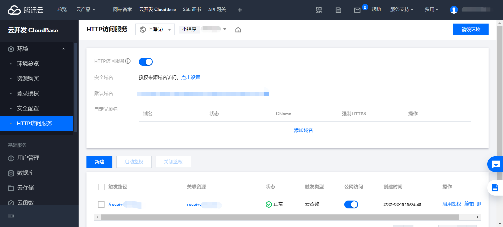

# tcb-wxpay

cloudbase function + tenpay

使用腾讯云开发云函数实现的[微信支付apiV3](https://pay.weixin.qq.com/wiki/doc/apiv3/open/pay/chapter2_8_0.shtml)，小程序支付通道（非腾讯云开发云调用的微信支付）

在微信小程序里使用微信支付，多数人首选腾讯云开发原生的[云调用能力 - 微信支付](https://developers.weixin.qq.com/miniprogram/dev/wxcloud/guide/wechatpay/wechatpay.html)，以腾讯云开发作为服务商提供的微信支付方案。

然而，实测后发现，支付后的支付凭证上少了一个常见的入口`商家小程序`，看得很难受，如下图所示。


另外，star数排名靠前的[第三方开源的微信支付方案](https://github.com/befinal/node-tenpay)，仍然使用的是apiV2，基于安全和适应新特性的考量，也没有被考虑。

为了在支付凭证上看到`商家小程序`入口，于是自己搭了本仓库所示的支付链路，其中包括通信参数和两道签名的关卡。最后实现了基于腾讯云函数实现的微信支付apiV3统一下单，得到如愿以偿的支付凭证如下图所示。


------

<br />

## 前置工作

1. 有一个微信小程序账号 https://mp.weixin.qq.com/

2. 有一个微信商户号 https://pay.weixin.qq.com/

3. 依照微信支付`接入前准备`操作 https://pay.weixin.qq.com/wiki/doc/apiv3/open/pay/chapter2_8_1.shtml


------

<br />

## 文件解释

支付时，需要一个后端服务器和微信支付服务器发起[统一下单](https://pay.weixin.qq.com/wiki/doc/apiv3/apis/chapter3_5_1.shtml)，取得`prepay_id`，接着对其签名获得`paySign`，再将包裹传回前端，以获得发起`wx.requestPayment()`所需的参数。

本仓库下 `cloudFuncs/` 目录下就是核心代码。其中

-  `requestOrder/` 表示统一下单的逻辑
-  `receiveOrderResult/` 用于接收支付回调的云函数，需要一个 `return {errcode: 0}` 回传给微信支付


### 开启Http访问

用于接收支付回调的云函数需要至[云开发控制台](https://www.cloudbase.net/)开启Http访问服务，得到一个可http访问`receiveOrderResult`云函数的url，再将此url填入 `requestOrder/index.js` 里的 `NOTIFY_URL` 中




### 替换证书和密钥

在 `requestOrder/certKey` 文件夹下存放了证书和密钥，用于签名方案`SHA256 with RSA`

请按照`接入前准备 - 下载并配置商户证书` 操作 https://pay.weixin.qq.com/wiki/doc/apiv3/open/pay/chapter2_8_1.shtml#part-5

生成 `apiclient_cert.pem`和`apiclient_key.pem`，并替换掉 `requestOrder/certKey` 文件夹下的文件。


### 安装依赖

在 `requestOrder`节点下，安装依赖
```shell
npm install
```

------

<br />

## 在小程序里使用

```javascript
wx.cloud.callFunction({
    name: "requestOrder",
    data: {fee: 200},  //单位为“分”
    success(res) {
        console.log("回调结果...")
        console.log(res)
        let result = res.result || {}
        let payment = result.payment
        if(payment) {
            console.log("发起支付...")
            wx.requestPayment({
                ...payment,
                success(res2) {},
                fail(err2) {},
            })
        }
    },
    fail(err) {
        console.log(err)
    }
})

```

------

<br />

## License
The project is released under the [MIT license](LICENSE).
